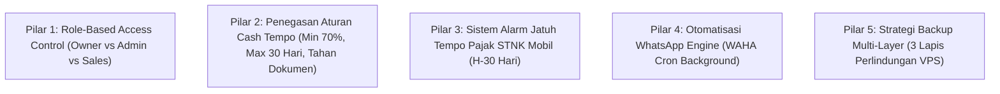
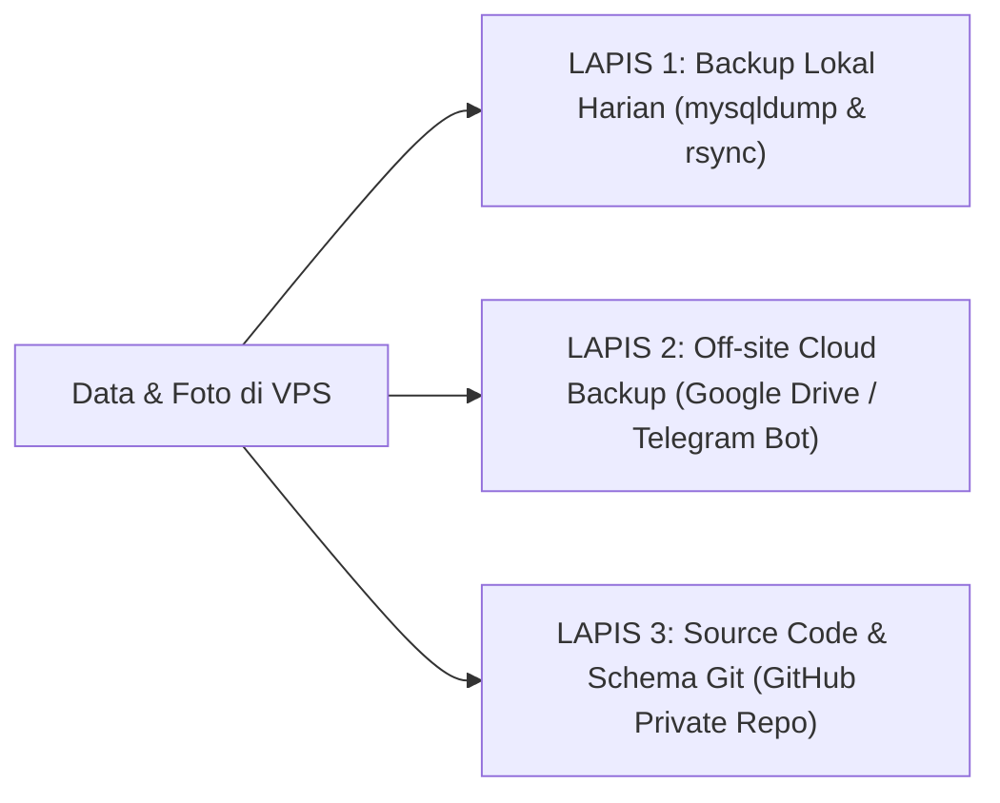

# 🚀 DOKUMEN RENCANA AKSI (ACTION PLAN) PENGEMBANGAN SISTEM
## Aplikasi Showroom & Bengkel Mandiri — Nur Mobil
*Kebijakan Khusus: 100% Cash / Cash Tempo Internal (Non-Kredit Leasing) & Multi-Layer VPS Backup*

---

## 🎯 PRINSIP & KEBIJAKAN UTAMA BISNIS NUR MOBIL

Berdasarkan arahan langsung pemilik showroom:
1. **TIDAK MENERIMA KREDIT LEASING / BANK:** Seluruh penjualan hanya melayani **Tunai Lunas (Cash Keras)** atau **Cash Tempo Internal Garasi**.
2. **ATURAN CASH TEMPO INTERNAL GARASI:**
   - **Uang Muka (DP) Minimal 70%:** Transaksi tempo wajib membayar DP minimal 70% dari harga kesepakatan saat serah terima unit.
   - **Maksimal Tempo 30 Hari (1 Bulan):** Sisa pelunasan 30% wajib diselesaikan dalam tempo maksimal 30 hari.
   - **Dokumen Ditahan di Brankas Showroom:** BPKB asli dan STNK asli **wajib ditahan oleh pihak Nur Mobil** sampai pelunasan lunas 100%. Konsumen hanya membawa unit dengan Surat Jalan resmi sementara.
3. **INFRASTRUKTUR VPS MANDIRI & BACKUP MULTI-LAYER (3 LAPIS):**
   - Foto dan media tetap disimpan di volume lokal VPS sendiri (gratis 100%, kencang, tanpa biaya pihak ketiga).
   - Diterapkan **Multi-Layer Backup Strategy (3 Lapis Cadangan)** agar data showroom anti-hilang jika terjadi insiden pada server VPS.

---

## 📑 5 PILAR ACTION PLAN PENGEMBANGAN

---

### PILAR 1: ROLE-BASED ACCESS CONTROL (RBAC) & PERLINDUNGAN PRIVASI DATA

#### 🎯 Masalah yang Diselesaikan:
Saat ini siapapun yang login dapat melihat seluruh saldo rekening bank BCA, riwayat bagi hasil investor, penarikan prive pemilik, dan HPP modal asli lelang. Ini sangat berisiko jika aplikasi dipegang staf/karyawan garasi.

#### 🛠️ Spesifikasi Implementasi:
Kita akan menerapkan 3 tingkatan hak akses (*Roles*):

1. **Role `OWNER` (Pemilik Showroom):**
   - Akses tak terbatas ke seluruh halaman dan menu.
   - Melihat dan mengedit Buku Kas BCA, Tarik Prive Pribadi, Tambah Ekuitas.
   - Mengelola Akun Investor, Setoran Modal Pool, dan Eksekusi Dividen Bagi Hasil.
   - Melihat HPP modal asli lelang dan laba kotor bersih per unit mobil.

2. **Role `STAFF_ADMIN` (Kasir / Petugas Garasi):**
   - Input Intake Mobil Baru, Cek Fisik 11 Panel, dan Ganti Oli Mandiri.
   - Mencatat pengeluaran bengkel cat/perbaikan unit.
   - Mencatat transaksi penjualan dan penerimaan angsuran pembayaran konsumen.
   - Mencetak seluruh dokumen PDF: SPK, BAST, Kuitansi, Surat Jalan Bengkel, Price Tag Spion.
   - **Diproteksi:** Angka Saldo Kas BCA, Menu Investor, Menu Prive Owner, dan nominal laba bersih investor di-hide (disembunyikan) atau diburamkan.

3. **Role `SALES_MARKETING` (Tenaga Penjual Lapangan):**
   - Hanya dapat melihat daftar mobil yang berstatus *READY_FOR_SALE*.
   - Hanya melihat Harga Jual Listing (tidak tahu HPP beli lelang atau biaya perbaikan).
   - Mencetak Price Tag Spion dan membagikan link katalog publik via WhatsApp.

#### 📅 Tahapan Pengerjaan:
- [ ] Tambahkan field `role` (`OWNER`, `STAFF_ADMIN`, `SALES`) di model `User` database Prisma.
- [ ] Buat proteksi otentikasi di `middleware.ts` untuk route `/admin/finance`, `/admin/investors`, dan `/admin/settings`.
- [ ] Terapkan conditional rendering komponen finansial sensitif pada tabel inventori dan dashboard.

---

### PILAR 2: PENEGASAN ATURAN CASH TEMPO KHUSUS NUR MOBIL (NON-KREDIT)

#### 🎯 Masalah yang Diselesaikan:
Memastikan staf tidak salah memasukkan transaksi kredit leasing dan mencegah pemberian tempo tanpa DP yang memadai.

#### 🛠️ Spesifikasi Implementasi:
1. **Validasi Form Penjualan (`/admin/sales/new`):**
   - Pilihan metode penjualan hanya 2: **CASH_SETTLED (Tunai Keras Lunas)** dan **INTERNAL_TEMPO (Cash Tempo Garasi Nur Mobil)**.
   - Jika memilih *Cash Tempo*:
     * Sistem memvalidasi otomatis: **Nominal DP wajib minimal 70%** dari harga kesepakatan. Jika staf memasukkan DP di bawah 70%, form akan menolak dan memberi peringatan.
     * Batas maksimal tanggal jatuh tempo **dikunci maksimal 30 hari** dari tanggal transaksi jual.
2. **Klausul Tegas di Surat Perjanjian Jual Beli (SPK PDF):**
   - Menambahkan pasal khusus yang dicetak tebal:
     > *"Pasal Jaminan Dokumen: Pembelian dilakukan secara Cash Tempo Garasi dengan DP [70%]. Asli BPKB dan Asli STNK tetap berada dalam penguasaan fisik pihak Showroom Nur Mobil dan baru akan diserahkan setelah sisa pelunasan [30%] dinyatakan lunas 100%."*
   - Konsumen hanya dibekali Surat Jalan Sementara dan salinan fotokopi STNK legalisir.

#### 📅 Tahapan Pengerjaan:
- [ ] Update validasi Zod schema di `src/lib/validations/sale.ts` (minimal DP 70%, max tempo 30 hari).
- [ ] Perbarui template SPK PDF di `src/components/pdf/SaleAgreementPdfDocument.tsx` dengan klausul penahanan BPKB/STNK.
- [ ] Pasang badge proteksi dokumen di halaman detail penjualan.

---

### PILAR 3: SISTEM ALARM JATUH TEMPO PAJAK STNK MOBIL (PKB H-30 HARI)

#### 🎯 Masalah yang Diselesaikan:
Mobil yang dipajang di garasi berbulan-bulan rawan terlewat tanggal pembayaran pajaknya. Jika pajaknya mati di garasi, nilai jual mobil langsung anjlok saat ditawar konsumen.

#### 🛠️ Spesifikasi Implementasi:
1. **Penambahan Data Pajak di Intake Mobil:**
   - `taxExpiryDate`: Tanggal jatuh tempo Pajak Tahunan STNK (PKB).
   - `platExpiryDate`: Tahun kaleng plat 5 tahunan (contoh: 2029).
   - `taxStatus`: *HIDUP*, *MATI_KURANG_1_TAHUN*, *MATI_LEBIH_1_TAHUN*.
2. **Widget Alarm Pajak di Dashboard:**
   - Muncul kartu peringatan jika ada mobil pajangan yang pajaknya akan mati dalam waktu **≤ 30 hari ke depan**.
   - Indikator warna: Kuning jika tersisa < 30 hari, Merah jika sudah mati (*expired*).
   - Opsi tindakan cepat: *"Perpanjang Pajak via Biro Jasa"* (langsung menambah HPP mobil) atau *"Jual Kondisi Pajak Apa Adanya"*.

#### 📅 Tahapan Pengerjaan:
- [ ] Tambahkan field `taxExpiryDate`, `platExpiryDate`, `taxStatus` di model `Vehicle` di Prisma schema.
- [ ] Tambahkan input pajak di form `VehicleNewClient.tsx` dan `VehicleStatusClient.tsx`.
- [ ] Buat Card Alarm Pajak Mobil di `DashboardClient.tsx`.

---

### PILAR 4: OTOMATISASI WHATSAPP ENGINE (WAHA BACKGROUND WORKER)

#### 🎯 Masalah yang Diselesaikan:
Saat ini reminder WhatsApp masih manual (harus diklik admin). Dengan otomatisasi, pengingat jatuh tempo H-3 dan H-1 bisa terkirim otomatis di latar belakang saat jam kerja (pukul 09.00 WIB).

#### 🛠️ Spesifikasi Implementasi:
1. Mengaktifkan container **WAHA (WhatsApp HTTP API)** yang sudah ada di file `docker-compose.waha.yml` pada VPS Anda.
2. Owner cukup scan QR code WhatsApp nomor hotline showroom satu kali.
3. Hubungkan cron job `/api/cron/reminders` untuk menembak API WAHA secara otomatis setiap pagi:
   - Mengirim reminder sopan H-3 sebelum tempo 30 hari berakhir.
   - Mengirim notifikasi selamat datang dan link kuitansi digital sesaat setelah pelunasan tercatat.
   - Tetap mempertahankan tombol manual Click-to-WA sebagai cadangan.

#### 📅 Tahapan Pengerjaan:
- [ ] Verifikasi konfigurasi WAHA di `docker-compose.waha.yml`.
- [ ] Sempurnakan service `src/lib/services/whatsapp.ts` untuk mendukung dual mode: *Auto-Send via WAHA* dengan fallback ke *Click-to-WA Link*.

---

### PILAR 5: STRATEGI BACKUP MULTI-LAYER (3 LAPIS PERLINDUNGAN VPS)

Karena Anda menggunakan VPS sendiri untuk aplikasi dan penyimpanan foto, **kehilangan data (server crash / harddisk VPS rusak)** adalah risiko fatal yang harus dicegah dengan strategi cadangan berlapis:

#### 🛡️ LAPIS 1: Backup Lokal Otomatis di VPS (Daily Snapshot Rotasi 7 Hari)
* **Cara Kerja:** Cron job berjalan setiap tengah malam (pukul 02.00 WIB) di VPS.
* **Isi Cadangan:**
  - Dump database MySQL (`mysqldump`) terkompresi `.sql.gz`.
  - Arsip folder foto unit `public/images/cars` terkompresi `.tar.gz`.
* **Retensi:** Menyimpan 7 hari terakhir secara otomatis (hari ke-8 otomatis terhapus agar harddisk VPS tidak penuh).
* **Lokasi di VPS:** Folder `/var/backups/nur-mobil/`.

#### 🛡️ LAPIS 2: Off-Site Cloud Backup Otomatis (100% GRATIS)
*Jika VPS fisik Anda terbakar, terkena ransomware, atau provider VPS bermasalah, Lapis 1 ikut hilang! Karena itu Lapis 2 wajib berada di luar server:*
* **Pilihan A: Otomatis ke Google Drive Pribadi via `rclone` (Direkomendasikan)**
  - Menggunakan tool open-source `rclone` (gratis 100%).
  - Setiap kali Lapis 1 selesai dibuat, file `.sql.gz` otomatis di-upload ke folder Google Drive pribadi Anda (memanfaatkan kuota gratis 15 GB Google Drive).
* **Pilihan B: Otomatis Dikirim ke Bot Telegram Pribadi Owner (Paling Praktis)**
  - Script backup otomatis mengirimkan file database `backup_nurmobil_YYYYMMDD.sql.gz` ke ruang chat Telegram pribadi Anda setiap pukul 02.30 WIB.
  - File tersimpan di cloud Telegram gratis selamanya dan bisa Anda download kapan saja dari HP.

#### 🛡️ LAPIS 3: Source Code & Disaster Recovery Playbook
* **Source Code:** Tersimpan rapi di GitHub Private Repository Anda (`https://github.com/monlievt/showroom`).
* **Disaster Recovery Playbook:** Dokumentasi 1 halaman berisi perintah restore: jika ganti VPS baru, cukup jalankan 1 perintah `docker-compose up` dan restore file database terakhir, aplikasi langsung pulih dalam 5 menit.

---

## 📅 MATRIKS URUTAN EKSEKUSI (ROADMAP IMPLEMENTASI)

| Fase | Fokus Pekerjaan | Estimasi & Prioritas |
| :---: | :--- | :---: |
| **FASE 1** | **Aturan Cash Tempo 70% & Klausul Tahan Dokumen** • Validasi DP minimal 70% & tempo max 30 hari • Klausul jaminan BPKB/STNK ditahan di cetakan SPK PDF | **Prioritas Utama** (Keamanan Transaksi Harian) |
| **FASE 2** | **Sistem Alarm Jatuh Tempo Pajak STNK Mobil** • Kolom tanggal pajak di form intake mobil • Widget radar mobil pajangan H-30 pajak mati di Dashboard | **Prioritas Tinggi** (Mencegah Nilai Mobil Anjlok) |
| **FASE 3** | **Role-Based Access Control (Owner vs Staf Garasi)** • Role OWNER, STAFF_ADMIN, SALES • Proteksi privasi saldo BCA, prive, dan modal HPP lelang | **Prioritas Tinggi** (Kerahasiaan Finansial) |
| **FASE 4** | **Multi-Layer Backup Script (Lokal + Telegram/GDrive)** • Script backup database & foto otomatis • Otomatisasi pengiriman off-site gratis | **Prioritas Sangat Penting** (Ketahanan Data VPS) |
| **FASE 5** | **Integrasi Background WhatsApp Engine (WAHA)** • Aktivasi container WAHA di VPS • Pengiriman reminder otomatis H-3 jatuh tempo | **Prioritas Pendukung** (Efisiensi Operasional) |

---
*Dokumen Action Plan ini siap dieksekusi secara bertahap sesuai persetujuan pemilik showroom.*
