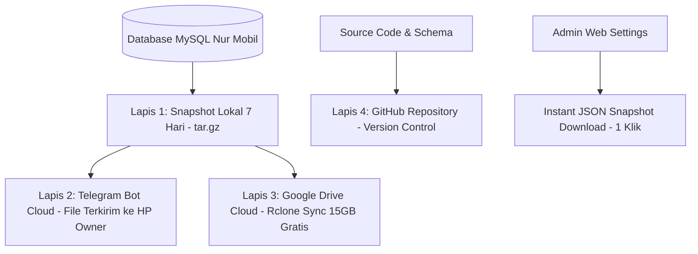

# 📖 BUKU PANDUAN PENGGUNAAN LENGKAP SISTEM
## Aplikasi Manajemen Showroom & Bengkel Mandiri — Nur Mobil
*Versi Sistem: Produksi 2026 | Berbasis Next.js App Router, Prisma ORM, MySQL & Gemini AI*

---

## 📑 DAFTAR ISI UTAMA

1. [Bab 1: Ikhtisar Arsitektur, Filosofi & Kebijakan Cash Tempo Garasi](#bab-1-ikhtisar-arsitektur-filosofi--kebijakan-cash-tempo-garasi)
2. [Bab 2: Katalog Publik & Halaman Konsumen (Customer-Facing)](#bab-2-katalog-publik--halaman-konsumen-customer-facing)
3. [Bab 3: Portal Khusus Investor (Investor Portal)](#bab-3-portal-khusus-investor-investor-portal)
4. [Bab 4: Dashboard Utama, Asisten AI & Radar Alarm Pajak STNK](#bab-4-dashboard-utama-asisten-ai--radar-alarm-pajak-stnk)
5. [Bab 5: Manajemen Data Mobil (Inventori Unit) & Alur Status](#bab-5-manajemen-data-mobil-inventori-unit--alur-status)
6. [Bab 6: Intake Unit Baru, Balai Lelang & Pencatatan Jatuh Tempo Pajak](#bab-6-intake-unit-baru-balai-lelang--pencatatan-jatuh-tempo-pajak)
7. [Bab 7: Lembar Kerja Cek Fisik & Inspeksi 11 Panel (Standar ACV IBID)](#bab-7-lembar-kerja-cek-fisik--inspeksi-11-panel-standar-acv-ibid)
8. [Bab 8: Gudang Bahan Habis Pakai, Servis Mandiri & Aset Peralatan](#bab-8-gudang-bahan-habis-pakai-servis-mandiri--aset-peralatan)
9. [Bab 9: Penjualan Cash Tempo Garasi (Anti-Leasing), Piutang & Alarm](#bab-9-penjualan-cash-tempo-garasi-anti-leasing-piutang--alarm)
10. [Bab 10: Pelunasan Pembayaran & Jembatan Bagi Hasil Investor](#bab-10-pelunasan-pembayaran--jembatan-bagi-hasil-investor)
11. [Bab 11: Modul Keuangan: Buku Kas BCA, Biaya Operasional & Prive](#bab-11-modul-keuangan-buku-kas-bca-biaya-operasional--prive)
12. [Bab 12: Investor & Bagi Hasil: Unit Siap Bagi Hasil, Akun & Aturan Tiering](#bab-12-investor--bagi-hasil-unit-siap-bagi-hasil-akun--aturan-tiering)
13. [Bab 13: Dokumen Legal & Cetak PDF Otomatis (Termasuk SPK Pasal V)](#bab-13-dokumen-legal--cetak-pdf-otomatis-termasuk-spk-pasal-v)
14. [Bab 14: Keamanan Sistem & Hak Akses Multi-Peran (RBAC 4 Role)](#bab-14-keamanan-sistem--hak-akses-multi-peran-rbac-4-role)
15. [Bab 15: Sistem & Notifikasi serta Strategi Multi-Layer Backup VPS Sendiri](#bab-15-sistem--notifikasi-serta-strategi-multi-layer-backup-vps-sendiri)

---

## BAB 1: IKHTISAR ARSITEKTUR, FILOSOFI & KEBIJAKAN CASH TEMPO GARASI

Aplikasi **Nur Mobil Showroom** dirancang khusus untuk memadukan efisiensi operasional fisik di garasi dengan ketertiban akuntansi jual-beli mobil bekas modern di Indonesia:

1. **Harga Pokok Penjualan (HPP) Multi-Komponen:** Modal satu unit mobil bukan hanya harga beli lelang, melainkan akumulasi otomatis dari:
   $$\text{HPP Total} = \text{Harga Beli Faktur} + \text{Biaya Admin Lelang} + \text{Ongkos Towing} + \text{Servis Mesin} + \text{Cat Bodi} + \text{Detailing Salon} + \text{Suku Cadang}$$
2. **Pengakuan Upah Servis Mandiri:** Pekerjaan rutin (ganti oli mesin, filter, bohlam, cuci detailing) dikerjakan oleh mekanik internal garasi. Selisih tarif servis yang dibebankan ke mobil vs harga beli grosir bahan diakui sebagai **Laba Jasa Garasi Mandiri**, mencegah kebocoran uang kas ke bengkel luar.
3. **Kebijakan Cash Tempo Garasi (Anti-Leasing & Bebas Riba):**
   Nur Mobil menjalankan prinsip transaksi syari dan independen tanpa melibatkan perusahaan pembiayaan (leasing). Untuk pembeli yang membutuhkan pembayaran bertahap, showroom memberlakukan aturan tegas:
   - **Tanpa Bunga, Denda, atau Asuransi Riba:** Transaksi murni jual-beli tunai bertahap.
   - **Uang Muka (DP) Minimal 70%:** Pembeli wajib menyetorkan minimal 70% dari harga kesepakatan saat penandatanganan SPK. Sistem akan menolak jika DP di bawah 70%.
   - **Maksimal Tempo 30 Hari (1 Bulan):** Sisa pelunasan (maksimal 30%) wajib lunas dalam waktu maksimal 30 hari kalender.
   - **Penahanan Fisik Dokumen Asli BPKB & STNK:** Kedua dokumen asli kendaraan disimpan di brankas besi Nur Mobil sebagai jaminan hukum. Kendaraan hanya boleh dikendarai pembeli dengan surat jalan resmi dan dilarang dipindahtangankan/dibawa keluar pulau sebelum lunas 100%. Dilindungi klausul hukum tertulis pada **SPK Pasal V**.
4. **Radar Alarm Pajak STNK & Plat Kaleng 5 Tahunan:** Mencegah kerugian denda pajak kendaraan dan komplain konsumen dengan mendeteksi unit yang pajaknya mendekati jatuh tempo (H-30 Hari) maupun yang sudah lewat tempo (*Overdue*).
5. **Multi-Role RBAC (4 Peran):** Pemisahan hak akses ketat antara *Owner*, *Staff Admin*, *Sales*, dan *Investor* untuk menjaga kerahasiaan keuangan dan mencegah salah hapus data.
6. **Multi-Layer Backup Bebas Biaya untuk VPS Sendiri:** Strategi pencadangan 4 lapis (Lokal 7 hari, Telegram Bot Cloud, Google Drive Rclone, dan GitHub) yang menjamin nol risiko kehilangan data.

---

## BAB 2: KATALOG PUBLIK & HALAMAN KONSUMEN (CUSTOMER-FACING)

Website publik dapat diakses langsung oleh calon pembeli tanpa perlu login. Menampilkan stok unit secara transparan, lengkap dengan rekam jejak inspeksi fisik dan status perputaran garasi.

### 1. Halaman Beranda (Landing Page — `/`)
Halaman depan showroom menyajikan 3 etalase utama yang disusun secara dinamis:
1. **Unit Pilihan Siap Pakai (Ready Stock):**
   - Menampilkan maksimal **6 unit mobil** berstatus `READY_FOR_SALE` dan `BOOKED`.
   - **Kriteria Urutan:** Diurutkan berdasarkan **`createdAt: "desc"`** (unit yang paling baru diinput/diperbarui oleh admin showroom tampil di posisi teratas).
   - Menampilkan kartu foto HD, badge status, kilometer odo, transmisi, harga tunai, dan tombol *Lihat Detail & Hasil Inspeksi*.
2. **Segera Hadir di Showroom (Upcoming Stock / Dalam Persiapan):**
   - Menampilkan maksimal **4 unit mobil** berstatus `INTAKE` (baru tiba) dan `IN_REPAIR` (tahap salon/poles/bengkel).
   - **Kriteria Urutan:** Diurutkan berdasarkan **`createdAt: "desc"`** (unit terbaru yang masuk garasi).
   - **Strategi Teaser 1 Foto:** Hanya menampilkan **1 foto tampak depan serong kanan (`FRONT_3_4`)**, menjaga dokumentasi internal cacat/bodi kotor garasi tetap privat.
   - **Harga Psikologis Indonesia:** Ditampilkan dalam format ramah psikologi pembeli, contoh: **`Estimasi Rp 150 Jutaan`** (dihitung otomatis melalui helper `formatUpcomingPrice`). Mencegah showroom terikat komitmen harga mati sebelum kalkulasi biaya perbaikan dan salon selesai dihitung riil.
   - Tombol CTA: *"Booking Duluan / Lihat Info"*.
3. **Unit yang Baru Saja Terjual (Sold Out Reel):**
   - Menampilkan maksimal **4 unit mobil** berstatus `SOLD_SETTLED`.
   - **Kriteria Urutan:** Diurutkan berdasarkan **`updatedAt: "desc"`** (unit yang paling baru diserahterimakan ke konsumen).
   - Disertai nama pembeli, asal domisili, dan harga transaksi riil sebagai bukti rekam jejak transparansi garasi.

### 2. Katalog Lengkap Mobil (`/katalog`)
- **5 Tab Filter Kategori Status:**
  1. **Semua Unit (`ALL`):** Menampilkan seluruh etalase mobil yang aktif maupun arsip.
  2. **Tersedia di Showroom (`READY_FOR_SALE`):** Unit siap pakai yang sudah lolos uji inspeksi.
  3. **Segera Hadir (`UPCOMING`):** Menggabungkan unit `INTAKE` & `IN_REPAIR` (baru masuk / dalam persiapan).
  4. **Sudah Dibooking (`BOOKED`):** Unit yang telah terikat uang muka (DP) konsumen.
  5. **Terjual Lunas (`SOLD_SETTLED`):** Arsip transaksi lunas sebagai rekam jejak kondisi fisik.
- **Aturan Urutan (Sorting & Ranking):**
  - **Saat di Tab "Semua Unit" (`ALL`):** Sistem menerapkan hierarki prioritas status pembeli:
    * *Prioritas 1:* `READY_FOR_SALE` (Stok siap transaksi tampil paling atas)
    * *Prioritas 2:* `BOOKED` (Unit tanda jadi)
    * *Prioritas 3:* `INTAKE` & `IN_REPAIR` (Segera Hadir / Teaser)
    * *Prioritas 4:* `SOLD_SETTLED` (Arsip unit laku di urutan terbawah)
    * *Di dalam masing-masing status diurutkan berdasarkan **`createdAt: "desc"` (tanggal upload terbaru)**.*
  - **Saat Memilih Tab Tertentu (misal tab "Segera Hadir" atau "Tersedia"):**
    * Seluruh kartu murni diurutkan berdasarkan **`createdAt: "desc"` (tanggal upload terbaru)**.
- **Filter Multi-Kriteria:** Filter instan berdasarkan Merk, Transmisi (Manual/Matic), dan Batas Maksimal Harga.

### 3. Detail Mobil, Lembar Cek Fisik & Click-to-WhatsApp (`/katalog/[slug]`)
- **Penanganan Khusus Unit Segera Hadir (Upcoming):**
  - **Banner Edukasi Garasi:** Menjelaskan secara transparan kepada calon pembeli bahwa unit sedang dalam tahap inspeksi fisik, perbaikan minor, dan salon detailing.
  - **Kartu Skor 4 Pilar Anti-Grade Palsu:** Jika unit belum diinspeksi (`inspection === null`), sistem **tidak akan menampilkan nilai grade palsu**. Sebaliknya, ditampilkan kartu status: **`TAHAP CEK — Kartu Skor & Grade Belum Diterbitkan`**.
  - **Lembar Inspeksi 160 Titik Transparan:** Bagian lembar inspeksi tetap ditampilkan dengan status *Sertifikat Digital Dalam Proses* dan pratinjau edukatif 4 pilar yang akan diuji (Sensor Mikron Cat 15 Titik, Ruang Mesin & Kompresi, Struktur Rangka Bebas Laka, dan Deteksi Residu Banjir).
- **Penanganan Unit Ready Jual:**
  - Galeri lengkap 11 sudut foto standar balai lelang ACV.
  - Skor Grade 4 Pilar (Mesin, Interior, Eksterior, Rangka) dan Total Grade.
  - Lembar checklist interaktif (Eksterior & Mikron Cat, Rangka Sasis, Mesin & Transmisi, Interior & Kelistrikan, Keabsahan Dokumen).
  - Tombol unduh Sertifikat Inspeksi Digital Resmi (PDF).

---

## BAB 3: PORTAL KHUSUS INVESTOR (INVESTOR PORTAL)

Portal khusus dapat diakses melalui rute `/investor` untuk memberikan transparansi penuh kepada pemodal perorangan tanpa memperlihatkan dapur operasional internal showroom.

### Fitur yang Dilihat Investor:
1. **Ringkasan Modal Berjalan:** Total dana modal yang disetor investor, berapa persen yang sedang aktif dibelikan mobil, dan berapa dana mengendap (*cash balance*).
2. **Daftar Mobil yang Dibiayai:** Rincian mobil yang dibeli menggunakan dana investor tersebut, lengkap dengan foto unit, tanggal beli, HPP berjalan, dan status unit (*Proses Perbaikan*, *Siap Jual*, atau *Terjual*).
3. **Riwayat Dividen Laba (Pencairan Hasil):** Tabel tanggal pencairan bagi hasil, nominal dividen yang ditransfer, nomor referensi mutasi BCA, dan persentase pembagian laba yang disepakati.

---

## BAB 4: DASHBOARD UTAMA, ASISTEN AI & RADAR ALARM PAJAK STNK
*Lokasi: Sidebar > Menu Operasional > Dashboard Utama (`/admin`)*

Dashboard dirancang sebagai ruang komando harian pemilik showroom.

### 1. Panel Asisten AI Showroom (Gemini AI Flash)
- **Tombol "Generate Rangkuman Harian AI":** Menganalisis kondisi showroom saat ini secara instan dan menyajikan poin-poin eksekutif:
  * Berapa unit yang harus segera dijual minggu ini.
  * Berapa kas yang aman dipakai kulakan ke lelang.
  * Peringatan dokumen BPKB yang belum diserahkan balai lelang.
- **Kotak Tanya-Jawab AI Interaktif:** Pemilik dapat mengetikkan pertanyaan bebas seperti:
  * *"Ada tawaran Innova Reborn 2017 harga 210jt eks perusahaan, aman diambil gak dengan sisa kas sekarang?"*
  * *"Unit mana yang marginnya paling tebal untuk promo akhir pekan?"*

### 2. Funnel Status Operasional Garasi
Widget KPI visual yang menampilkan pergerakan mobil secara horizontal:
- **Di Garasi:** Total seluruh unit fisik yang sedang ada di showroom.
- **Siap Jual (Ready for Sale):** Unit yang sudah selesai salon & servis, siap transaksi.
- **Baru Masuk (Intake):** Mobil yang baru tiba dari lelang, menunggu cek fisik.
- **Dalam Perbaikan (In Repair):** Mobil yang sedang dicat, ganti oli, atau di bengkel luar.
- **Booked:** Mobil yang sudah diikat tanda jadi (DP) oleh calon pembeli.
- **Stagnant (> 45 Hari):** Mobil macet yang perlu dievaluasi harga jualnya agar modal berputar.

### 3. Radar Alarm Pajak STNK & Plat Kaleng 5 Tahunan
Fitur pengawasan pajak aktif yang mendeteksi masa berlaku STNK dan kaleng plat nomor seluruh inventori mobil yang ada di garasi:
- **Lencana Status Dinamis:**
  * 🔴 **OVERDUE (Pajak Mati):** Masa berlaku STNK sudah terlewati. Wajib segera diurus agar mobil tidak kena denda progresif dan mudah dinegosiasikan dengan pembeli.
  * 🟡 **JATUH TEMPO H-30 HARI:** Masa berlaku tersisa kurang dari 30 hari kalender.
  * 🟢 **PAJAK HIDUP / AMAN:** Masa berlaku masih lebih dari 30 hari.
- **Ringkasan Beban Kas:** Menghitung total estimasi biaya perpanjangan pajak (PKB) yang harus disiapkan dari kas showroom.
- **Filter Cepat:** Tab filter *Semua*, *Jatuh Tempo H-30*, dan *Overdue* untuk mempermudah instruksi tugas ke staf biro jasa garasi.
- **Peringatan Plat Kaleng 5 Tahunan:** Memberi tanda jika masa kaleng 5 tahunan mendekati batas waktu cek fisik Samsat.

### 4. Proyeksi Arus Kas 14 Hari (14-Day Cashflow)
- **Proyeksi Kas Masuk (Est.):** Nominal piutang tempo yang diperkirakan cair dalam 2 minggu.
- **Proyeksi Kas Keluar (Est.):** Beban operasional setengah bulan + estimasi perbaikan unit + estimasi pajak jatuh tempo.
- **Net Cashflow & Cash Runway:** Berapa hari showroom dapat bertahan hidup jika sama sekali tidak ada mobil yang laku.

### 5. Alarm Piutang Cash Tempo + 1-Klik WA Reminder
- Banner peringatan warna rose/amber yang mendeteksi setiap piutang cash tempo yang mendekati tempo atau terlambat.
- **Tombol 1-Klik Kirim WA:** Membuka WhatsApp secara instan dengan pesan tagihan sopan dan formal.

---

## BAB 5: MANAJEMEN DATA MOBIL (INVENTORI UNIT) & ALUR STATUS
*Lokasi: Sidebar > Menu Operasional > Inventori Unit (`/admin/inventory`) (atau "Katalog Stok Ready" untuk Sales)*

### 1. Daftar Tabel Inventori Cerdas
- Menampilkan foto mini unit, plat nomor, merk, varian tahun, transmisi, HPP modal terkini, target harga jual, dan margin proyeksi.
- **Indikator Visibilitas Publik (Sub-Badge Status):**
  * Unit `INTAKE` & `IN_REPAIR` otomatis berlabel sub-badge: **`✨ Katalog: Segera Hadir`** sehingga staf admin langsung mengetahui bahwa mobil sedang ditayangkan sebagai *teaser* di website publik.
  * Unit `READY_FOR_SALE` berlabel sub-badge: **`Katalog: Tayang Lengkap`**.
- **Tautan Cepat Pratinjau Publik (*Direct Preview Link*):**
  * Tautan langsung di bawah nama mobil (*"Tampilan Segera Hadir"* / *"Tampilan Katalog"*) yang membuka pratinjau halaman katalog publik unit terkait di tab baru.
- **Kolom Status Pajak STNK:** Menampilkan tanggal jatuh tempo PKB dan status badge (🟢 Aman, 🟡 H-30, 🔴 Overdue) langsung pada baris tabel unit.
- **Filter Cepat:** Tab status *Semua Unit*, *Intake Baru*, *Pengerjaan / Bengkel*, *Ready Jual*, *Booked / DP*, dan *Terjual Lunas*.
- **Pencarian Cepat:** Pencarian instan berdasarkan plat nomor, nama merk, tipe, atau warna mobil.

### 2. Tombol Aksi di Atas Tabel Inventori:
- **`+ Intake Unit Baru`** (`/admin/inventory/new`): Membuka form pendaftaran mobil baru dari lelang/pembelian.
- **`Gudang Bahan & Servis Mandiri`** (`/admin/workshop`): Akses cepat ke gudang oli, filter, salon dan pencatatan laba jasa garasi.
- **`Import Spreadsheet`** (`/admin/inventory/import`): Import massal data mobil lama dari file Excel/CSV.

### 3. Sistem 1 Tombol Aksi Utama Kontekstual + Dropdown `[...]`:
Menggantikan ikon kecil yang membingungkan dengan tindakan paling logis berdasarkan siklus unit:
- Unit **INTAKE** ➔ Tombol Utama: **Cek Fisik** (warna biru)
- Unit **IN_REPAIR** ➔ Tombol Utama: **Catat Servis** (warna oranye)
- Unit **READY_FOR_SALE** ➔ Tombol Utama: **Tag Spion** (cetak price tag kaca)
- Unit **BOOKED** ➔ Tombol Utama: **Update Status**
- Unit **SOLD_SETTLED** ➔ Tombol Utama: **Terjual Lunas**
- Menu Titik Tiga `[...]` memuat aksi sekunder:
  * **Lihat di Katalog Publik (Segera Hadir / Ready)**
  * Cek Fisik & Inspeksi
  * Catat Biaya / Servis
  * Upload Foto & Dokumen
  * Surat Jalan Bengkel (SPK)
  * Cetak Tag Spion (QR)
  * Ubah Status Kendaraan
  * Share via WhatsApp

---

## BAB 6: INTAKE UNIT BARU, BALAI LELANG & PENCATATAN JATUH TEMPO PAJAK
*Lokasi: Sidebar > Menu Operasional > Inventori Unit > Tombol + Intake Unit Baru (`/admin/inventory/new`)*

### A. Panduan Pengisian Form Intake:
1. **Identitas Kendaraan:**
   - Plat Nomor (wajib huruf kapital, contoh: `B 1984 ZMR`).
   - Merk, Model, Varian, Tahun Pembuatan, Warna, Jenis Transmisi (Manual / Automatic), Jarak Tempuh (KM).
2. **Status Pajak STNK & Plat Kaleng 5 Tahunan:**
   - **Tanggal Jatuh Tempo PKB (Pajak Tahunan):** Tanggal masa berlaku pajak tahunan pada lembar STNK/Notice Pajak.
   - **Tanggal Jatuh Tempo Plat Kaleng 5 Tahunan:** Tanggal berakhirnya plat kaleng 5 tahunan (masa berlaku TNKB).
   - **Estimasi Biaya PKB (Pajak Tahunan):** Perkiraan nominal rupiah yang harus dibayar saat perpanjangan (misal: Rp 2.500.000). Data ini dipakai sistem untuk memproyeksikan kebutuhan kas garasi.
3. **Sumber Perolehan Unit:**
   - **AUCTION (Balai Lelang):** Masukkan nama balai lelang (IBID, JBA, Balindo, Caready), Nomor Lot Lelang, dan pilih Tipe Lot:
     * *Eks Perusahaan:* Mobil operasional PT, dokumen BPKB umumnya aman & cepat.
     * *Eks Tarikan Leasing:* Mobil tarikan kredit macet, pantau keabsahan surat pelepasan hak & masa tunggu BPKB.
   - **DIRECT_PURCHASE (Beli Langsung dari Pemilik)** atau **TRADE_IN (Tukar Tambah Konsumen)**.
4. **Komponen Finansial Awal:**
   - Harga Beli Faktur (Hammer Price).
   - Biaya Administrasi Lelang.
   - Target Harga Jual dan Batas Minimal Harga Jual (*Bottom Price* untuk negosiasi sales).
5. **Status Dokumen & Masa Tunggu:**
   - Status BPKB: *READY* (langsung ada) atau *PROCESS_1_2_WEEKS* (menunggu kedatangan).
   - Estimasi Hari Tunggu (default: 7 hari untuk lelang).

### B. Next-Step Success Dialog (Interaktif):
Setelah Anda menekan tombol **Simpan Unit Baru**, sistem memunculkan dialog pop-up konfirmasi yang menawarkan 4 opsi cepat:
1. **Ganti Oli Mandiri Sekarang:** Membuka pop-up alokasi oli dari gudang garasi Nur Mobil.
2. **Cetak Surat Jalan Bengkel (PDF):** Langsung mengunduh PDF surat jalan pengantar untuk sopir jika mobil langsung dikirim ke bengkel cat/perbaikan.
3. **Mulai Cek Fisik & Inspeksi:** Membuka lembar kerja inspeksi 11 panel cat bodi.
4. **Upload Foto & Dokumen:** Mengunggah foto-foto unit yang baru tiba.

---

## BAB 7: LEMBAR KERJA CEK FISIK & INSPEKSI 11 PANEL (STANDAR ACV IBID)
*Lokasi: Sidebar > Menu Operasional > Cek Fisik & Inspeksi (`/admin/inspections`)*

Fitur ini mengadopsi standar inspeksi profesional balai lelang ACV IBID untuk menjamin kejujuran kondisi unit kepada pembeli.

### 1. 11 Panel Bodi yang Diinspeksi:
1. Kap Mesin (Hood)
2. Atap (Roof)
3. Pintu Depan Kanan
4. Pintu Belakang Kanan
5. Fender Depan Kanan
6. Quarter Panel Belakang Kanan
7. Pintu Depan Kiri
8. Pintu Belakang Kiri
9. Fender Depan Kiri
10. Quarter Panel Belakang Kiri
11. Pintu Bagasi (Trunk/Tailgate)

### 2. Standar Ketebalan Cat (Mikron Meter / µm):
Inspektor mengukur dengan alat *Coating Thickness Gauge*:
- **80 – 130 µm:** Cat Asli / Pabrik (*ORIGINAL*).
- **140 – 220 µm:** Cat Ulang Tipis (*REPAINT*).
- **> 230 µm:** Bekas Dempul Tebal (*PUTTY/BODY REPAIR*).

### 3. Grading Kendaraan:
- **Grade Rangka (Chassis):** Grade A (Bebas tabrakan dan bebas karat banjir) hingga Grade D (Pernah kena pilar/apron).
- **Grade Mesin & Transmisi:** Grade A s/d D berdasarkan suara, getaran, kebocoran oli, dan kelancaran perpindahan gigi.
- **Grade Interior & Eksterior.**
- **Hasil:** Tersedia tombol cetak **Lembar Laporan Inspeksi Fisik PDF** resmi dengan diagram bodi mobil (*Car Blueprint Diagram*) untuk ditunjukkan ke calon pembeli.

---

## BAB 8: GUDANG BAHAN HABIS PAKAI, SERVIS MANDIRI & ASET PERALATAN
*Lokasi: Sidebar > Menu Operasional > Gudang Bahan & Alat (`/admin/workshop`)*

### 1. Tab 1: Stok Bahan Habis Pakai (Supplies)
Menampung barang-barang yang dibeli grosir:
- Oli Mesin (10W-40, 5W-30, 0W-20), Oli Transmisi, Minyak Rem.
- Filter Oli (Toyota, Honda, Suzuki, Daihatsu), Filter Udara, Filter AC.
- Bohlam Lampu Utama, Bohlam Rem, Sekring (Fuse).
- Sampo Mobil, Kompon Poles Kasar/Halus, Pad Poles, Lap Microfiber, Semir Ban.
- Setiap bahan memiliki pencatatan *Stok Masuk*, *Stok Terpakai*, dan *Sisa Stok Terkini*.

### 2. Mekanisme Alokasi Mandiri (Upah Garasi)
- Klik tombol **Pakai ke Mobil** pada bahan yang ingin digunakan.
- Pilih mobil yang sedang dikerjakan.
- Masukkan jumlah pakai (misal: 1 galon oli + 1 filter).
- Masukkan **Tarif Servis yang Dibebankan ke HPP Mobil** (misal: Rp 500.000).
- **Efek Akuntansi Otomatis:**
  * Modal HPP Mobil bertambah Rp 500.000 (vendor otomatis: *"Garasi Mandiri Nur Mobil"*).
  * Stok oli berkurang 1 galon di gudang.
  * Selisih untung (misal: Rp 500.000 tarif - Rp 320.000 modal grosir = **Rp 180.000**) dicatat ke metrik **Total Laba Jasa Garasi Terkumpul**.

### 3. Tab 2: Aset Tetap & Peralatan Garasi
Mencatat inventaris alat kerja bengkel:
- Mesin Cuci Steam High Pressure, Kompresor Angin, Mesin Poles Rotary/Dual Action, Dongkrak Buaya 3 Ton, Jack Stand, Toolkit Kunci Pas/Shock.
- Nilai aset tercatat sebagai inventaris tetap showroom dan tidak habis dalam sekali pakai.

### 4. Tab 3: Riwayat Alokasi ke Mobil
Daftar kronologis seluruh servis dan detailing mandiri yang pernah dilakukan pada unit, memuat tanggal, plat nomor, jenis bahan yang digunakan, dan laba jasa yang dihasilkan.

---

## BAB 9: PENJUALAN CASH TEMPO GARASI (ANTI-LEASING), PIUTANG & ALARM
*Lokasi: Sidebar > Menu Operasional > Penjualan & Piutang (`/admin/sales`)*

Nur Mobil hanya melayani dua metode pembayaran: **Cash Keras (Lunas 100%)** atau **Cash Tempo Garasi Maksimal 30 Hari**.

### 1. Aturan Validasi Ketat Cash Tempo di Form Penjualan (`/admin/sales/new`):
- **Wajib DP Minimal 70%:**
  Saat admin/sales menginput Harga Jual Kesepakatan, sistem otomatis menghitung batas minimal DP:
  $$\text{Minimal DP} = \text{Harga Jual} \times 70\%$$
  Jika staf mencoba memasukkan DP di bawah 70% (misal hanya 30% atau 50%), sistem akan memunculkan pesan validasi merah dan **mengunci tombol Simpan Transaksi**:
  > *"Peringatan Kebijakan Garasi: DP Minimal 70% (Rp ...). Cash tempo tidak boleh di bawah ketentuan ini!"*
- **Batas Jatuh Tempo Maksimal 30 Hari:**
  Sistem hanya mengizinkan pemilihan tanggal pelunasan paling lambat **30 hari** sejak tanggal transaksi. Jika dipilih tanggal lebih dari 30 hari, formulir akan menolak.
- **Klausul Penahanan BPKB & STNK Asli:**
  Pada formulir penjualan ditampilkan box peringatan berwarna biru:
  > *"Sesuai SOP Nur Mobil: BPKB dan STNK Asli tetap disimpan di brankas garasi sampai sisa piutang lunas 100%. Konsumen hanya menerima unit kendaraan dengan Surat Jalan Sementara."*

### 2. Buku Piutang & Status Lencana Tempo (Receivable Badges)
Setiap transaksi tempo memiliki indikator visual otomatis:
- 🟢 **ON_SCHEDULE:** Sisa hari masih aman (> 7 hari).
- 🟡 **DUE_SOON:** Sisa 1 hingga 7 hari sebelum tempo.
- 🔴 **OVERDUE:** Lewat dari tanggal jatuh tempo 30 hari.
- 🟢 **Lunas 100%:** Transaksi telah selesai (*settled*).

### 3. Click-to-WhatsApp Tagihan 1-Klik
Di samping baris piutang, klik ikon WhatsApp hijau untuk langsung mengirim pesan pengingat resmi atas nama Nur Mobil:
> *"Halo Pak/Bu [Nama], kami dari Nur Mobil mengonfirmasi sisa pelunasan Cash Tempo unit [Mobil] ([Plat]) sebesar Rp [Sisa] yang jatuh tempo pada [Tanggal]. Mengingat BPKB & STNK asli siap diserahkan saat pelunasan, mohon konfirmasi jadwal pelunasan via transfer BCA resmi kami. Terima kasih."*

---

## BAB 10: PELUNASAN PEMBAYARAN & JEMBATAN BAGI HASIL INVESTOR
*Lokasi: Sidebar > Penjualan & Piutang > Tombol + Catat Pembayaran Masuk (`/admin/sales/[id]/payment`)*

### 1. Mencatat Pembayaran Angsuran:
- Masukkan nominal pembayaran yang masuk.
- Pilih metode: Transfer Bank BCA, Cash Tunai, atau Tukar Tambah (Trade-In).
- Masukkan tanggal dan catatan transfer bank (misal: *Transfer m-BCA a.n. Sutrisno*).
- Sistem menampilkan perhitungan live sisa piutang baru.

### 2. Settlement Success Dialog (Jembatan Otomatis ke Investor):
Saat pembayaran mencapai 100% (sisa piutang menjadi Rp 0):
- Layar memunculkan dialog pop-up **Pembayaran Lunas Berhasil Dicatat**.
- **Jika Mobil Dibiayai Investor:**
  * Dialog langsung menampilkan lencana oranye: *"Unit Sah Didanai Investor"*.
  * Menampilkan nama pemodal yang berhak menerima dividen.
  * Menyediakan **Tombol Eksekusi Bagi Hasil Investor Sekarang (1-Klik)**:
    - Admin cukup menekan tombol ini langsung di dalam pop-up.
    - Sistem menjalankan transaksi database deterministik: memotong modal pokok, menghitung dividen laba sesuai aturan tiering, mencatat mutasi di *Capital Ledger*, dan menghasilkan snapshot permanen.
  * Tautan langsung ke halaman riwayat bagi hasil investor (`/admin/investors/history`).
- **Jika Mobil Modal Sendiri (100% Showroom):**
  * Dialog mengonfirmasi bahwa seluruh laba kotor unit telah masuk kas showroom.
- **Tombol Dokumen Lunas Langsung:** Tersedia tombol cetak BAST (penyerahan BPKB & STNK asli yang selama ini ditahan) dan Kuitansi Lunas di tempat.

---

## BAB 11: MODUL KEUANGAN: BUKU KAS BCA, BIAYA OPERASIONAL & PRIVE
*Lokasi: Sidebar > Keuangan & Kas > Buku Kas & Mutasi (`/admin/finance`) & Beban & Prive (BCA) (`/admin/finance/expenses`)*

### 1. Buku Kas & Rekening BCA (`/admin/finance`)
- Menampilkan Saldo Kas Berjalan riil rekening BCA showroom.
- **Mutasi Masuk:** Otomatis tercatat saat ada DP penjualan, pelunasan konsumen, atau setoran modal investor/owner.
- **Mutasi Keluar:** Otomatis tercatat saat kulakan unit lelang, pembayaran bengkel perbaikan, biaya operasional garasi, penarikan dividen investor, atau prive owner.
- Tombol aksi di halaman: **`+ Setor Ekuitas Pemilik`** (`/admin/finance/equity/new`) dan **`+ Catat Prive (Pribadi)`** (`/admin/finance/prive/new`).

### 2. Beban & Prive BCA (`/admin/finance/expenses`)
Mencatat beban tetap bulanan yang tidak melekat pada satu unit mobil tertentu:
- Sewa Lahan/Garasi Showroom.
- Tagihan Listrik PLN & Air PDAM Garasi.
- Biaya Konsumsi Mekanik & Penjaga Showroom.
- Gaji Karyawan & Komisi Penjualan Marketing.
- Kuota Internet, Pembelian Wi-Fi, dan ATK Kantor.
- Tombol aksi: **`+ Catat Biaya Operasional`** dan **`+ Tarik Prive (Pribadi)`**.

### 3. Multi-Lampiran Bukti Transaksi Keuangan Digital (ProofUploadField)
Seluruh modul transaksi keuangan (Kas Masuk/Keluar Manual, Biaya Operasional OpEx, Setoran Ekuitas Owner, Penarikan Prive, Pembelian Aset Inventaris, Biaya Servis Unit, hingga Pembayaran Penjualan) dilengkapi komponen **Multi-Lampiran Bukti**:
- Mendukung multi-select file sekaligus (JPG, PNG, WEBP, PDF hingga 10MB per file).
- Dilengkapi pratinjau thumbnail inline, status ukuran file, tombol hapus per file, serta link untuk membuka dokumen penuh di tab baru.
- Foto bukti servis pada unit mobil secara otomatis diarsipkan ke galeri foto kendaraan (`VehiclePhoto`).

### 4. Penarikan Dana Pribadi Pemilik / Prive (`/admin/finance/prive/new`)
Setiap kali pemilik showroom mengambil uang kas untuk keperluan pribadi keluarga:
- Dicatat sebagai transaksi **PRIVE**, lengkap dengan lampiran bukti transfer ke rekening pribadi.
- Mengurangi saldo kas BCA showroom tanpa merusak perhitungan laba-rugi bersih unit mobil yang dijual.

### 5. Setoran Modal Tambahan Pemilik / Ekuitas (`/admin/finance/equity/new`)
Digunakan saat pemilik menyuntikkan dana pribadi baru ke rekening BCA showroom untuk memperbesar modal kerja kulakan lelang, disertai unggahan bukti mutasi rekening.

---

## BAB 12: INVESTOR & BAGI HASIL: UNIT SIAP BAGI HASIL, AKUN & ATURAN TIERING
*Lokasi: Sidebar > Investor & Bagi Hasil (`/admin/investors`)*

Modul ini memiliki 4 sub-menu navigasi di Sidebar maupun sub-nav tab:

### 1. Unit Siap Bagi Hasil (`/admin/investors`)
Daftar seluruh mobil yang sudah terjual lunas 100% namun dividen labanya belum dibagikan kepada pemodal. Memuat harga beli, total HPP, harga jual, dan laba kotor riil, lengkap dengan tombol eksekusi bagi hasil per unit.

### 2. Daftar Akun Investor (`/admin/investors/accounts`)
Mencatat profil pemodal rekanan secara transparan:
- Nama Lengkap Investor, Nomor WhatsApp, Nomor Rekening Bank (BCA/Mandiri/BRI) untuk pencairan dividen, dan Kategori Investor (*Mitra Pihak Ketiga / Ibu 4 Saudara / Modal Owner*).
- **Edit Profil Investor:** Tersedia tombol edit langsung untuk memperbarui nomor kontak, catatan, maupun nomor rekening bank.
- Tombol aksi: **`+ Investor Baru`** (`/admin/investors/new`) dan **`+ Setor Modal`** (`/admin/investors/deposit/new` — dilengkapi upload multi-lampiran bukti mutasi transfer).

### 3. Riwayat Distribusi (`/admin/investors/history`)
Laporan audit permanen setiap pembagian dividen yang pernah dilakukan:
- Snapshot tanggal eksekusi.
- Rincian pembagian: Berapa bagian laba untuk Investor dan berapa untuk Owner/Garasi.
- Fitur *Reverse Distribution* (jika terjadi salah input transaksi dengan proteksi rollback mutasi modal).

### 4. Aturan Tier 4 Saudara (Skema Modal Ibu) (`/admin/investors/tier-rules`)
Showroom mengimplementasikan aturan pembagian dividen berjenjang otomatis untuk skema modal Ibu (4 saudara):
- **Tier 1 (Laba Rp 0 s/d Rp 1.000.000):** Rp 50.000 / saudara (Total Rp 200.000 untuk 4 orang).
- **Tier 2 (Laba Rp 1.000.001 s/d Rp 3.000.000):** Rp 100.000 / saudara (Total Rp 400.000).
- **Tier 3 (Laba Rp 3.000.001 s/d Rp 5.000.000):** Rp 200.000 / saudara (Total Rp 800.000).
- **Tier 4 (Laba Rp 5.000.001 s/d Rp 10.000.000):** Rp 300.000 / saudara (Total Rp 1.200.000).
- **Tier 5 (Laba Rp 10.000.001 s/d Rp 15.000.000):** Rp 500.000 / saudara (Total Rp 2.000.000).
- **Tier 6 (Laba Rp 15.000.001 s/d Rp 20.000.000):** Rp 750.000 / saudara (Total Rp 3.000.000).
- **Tier 7 (Laba > Rp 20.000.000):** Rp 1.000.000 / saudara (Total Rp 4.000.000).
- **Fleksibilitas Baris Tier:** Tabel dapat diedit langsung secara dinamis dengan tombol **+ Tambah Baris Tier** dan **Hapus Baris**.
- **Proteksi Saat Merugi (Laba <= Rp 0):** Jika unit dijual rugi atau impas, sistem secara deterministik menetapkan bagi hasil Rp 0 sehingga dividen tidak minus dan modal pokok investor tetap utuh.

---

## BAB 13: DOKUMEN LEGAL & CETAK PDF OTOMATIS (TERMASUK SPK PASAL V)

Sistem dilengkapi generator dokumen PDF berstandar legal industri showroom mobil:

### 1. Surat Perjanjian Jual Beli / SPK (`/api/pdf/agreement/[saleId]`)
- Memuat klausul identitas kendaraan: Nomor Rangka, Nomor Mesin, Plat Nomor, dan Kelengkapan Fisik.
- **Pasal V: Kebijakan Khusus Pembayaran Cash Tempo & Penahanan Dokumen Fisik:**
  * *Ayat 1:* Pembayaran dilakukan secara Cash Tempo Garasi dengan Uang Muka (DP) minimal 70% dan jangka waktu pelunasan maksimal 30 (tiga puluh) hari kalender tanpa bunga/denda riba.
  * *Ayat 2:* Selama sisa pembayaran belum dilunasi 100%, **dokumen fisik asli BPKB dan STNK kendaraan disimpan dan ditahan secara aman di brankas pihak Nur Mobil**.
  * *Ayat 3:* Pembeli hanya diberikan hak penguasaan fisik kendaraan untuk pemakaian operasional wajar, tidak diperkenankan menggadaikan, memindahtangankan, menyewakan, atau membawa kendaraan keluar pulau sebelum pelunasan penuh.
  * *Ayat 4:* Apabila sampai batas waktu 30 hari pembeli tidak melunasi kewajibannya, Nur Mobil berhak mengambil tindakan penarikan unit atau penyelesaian musyawarah sesuai hukum yang berlaku.
- Klausul garansi keabsahan dokumen dan tanda tangan kedua belah pihak di atas meterai.

### 2. Kuitansi / Faktur Pembayaran Lunas (`/api/pdf/invoice/[saleId]`)
- Format resmi nota penjualan bermeterai Rp 10.000.
- Mencantumkan nomor kwitansi unik, tanggal bayar, terbilang rupiah, dan tanda tangan penerima showroom.

### 3. Berita Acara Serah Terima / BAST (`/api/pdf/bast/[saleId]`)
- Dokumen serah terima fisik kendaraan saat mobil dibawa keluar showroom atau saat pelunasan lunas 100%.
- Checklist kelengkapan: Kunci cadangan, Buku servis, Tool kit, Dongkrak, Ban serep, STNK asli, Surat jalan, dan BPKB asli.

### 4. Price Tag Gantung Kaca Spion (`/api/pdf/spec-tag/[vehicleId]`)
- Dokumen desain vertikal yang siap dicetak dan digantung pada kaca spion tengah mobil di lantai showroom.
- Memuat merk, tipe, tahun, transmisi, keunggulan fitur, dan harga listing siap nego.

### 5. Surat Jalan Pengantar Bengkel Luar (`/api/pdf/workshop-dispatch/[vehicleId]`)
- Dokumen resmi pengantar saat mobil dikirim keluar showroom untuk pengerjaan perbaikan bodi, cat oven, atau perbaikan AC.

### 6. Lembar Laporan Inspeksi Cek Fisik (`/api/pdf/inspection/[id]`)
- Lembar penilaian kondisi bodi, cat per panel (mikron), mesin, dan rangka bebas laka/banjir untuk ditunjukkan ke konsumen saat negosiasi.

---

## BAB 14: KEAMANAN SISTEM & HAK AKSES MULTI-PERAN (RBAC 4 ROLE)

Untuk mencegah kebocoran data sensitif serta membatasi wewenang setiap personel tim garasi, sistem menerapkan kontrol akses berbasis peran (**Role-Based Access Control / RBAC**).

### Matriks Hak Akses 4 Peran (Sesuai Navigasi Sidebar Riil):

| Modul / Menu Sidebar | `OWNER` (Pemilik) | `STAFF_ADMIN` (Admin Garasi) | `SALES` (Marketing) | `INVESTOR` (Pemodal) |
| :--- | :---: | :---: | :---: | :---: |
| **Katalog Publik (`/katalog`)** | ✅ Ya | ✅ Ya | ✅ Ya | ✅ Ya |
| **Portal Investor (`/investor`)** | ✅ Ya | ❌ Dibatasi | ❌ Dibatasi | ✅ Akses Penuh |
| **Dashboard Utama (`/admin`)** | ✅ Ya | ✅ Ya | ❌ Disembunyikan | ❌ Terblokir |
| **Inventori Unit (`/admin/inventory`)** | ✅ Penuh | ✅ Penuh | ✅ Label: *Katalog Stok Ready* | ❌ Terblokir |
| **Cek Fisik & Inspeksi (`/admin/inspections`)** | ✅ Penuh | ✅ Penuh | ❌ Disembunyikan | ❌ Terblokir |
| **Gudang Bahan & Alat (`/admin/workshop`)** | ✅ Penuh | ✅ Penuh | ❌ Disembunyikan | ❌ Terblokir |
| **Penjualan & Piutang (`/admin/sales`)** | ✅ Penuh | ✅ Penuh | ❌ Disembunyikan | ❌ Terblokir |
| **Keuangan & Kas: Buku Kas & Mutasi (`/admin/finance`)** | ✅ Penuh | ❌ Disembunyikan / Ditolak | ❌ Disembunyikan | ❌ Terblokir |
| **Keuangan & Kas: Beban & Prive (`/admin/finance/expenses`)** | ✅ Penuh | ❌ Disembunyikan / Ditolak | ❌ Disembunyikan | ❌ Terblokir |
| **Investor & Bagi Hasil (`/admin/investors`)** | ✅ Penuh | ❌ Disembunyikan / Ditolak | ❌ Disembunyikan | ❌ Terblokir |
| **Sistem & Notifikasi (`/admin/settings`)** | ✅ Penuh | ❌ Disembunyikan / Ditolak | ❌ Disembunyikan | ❌ Terblokir |

### 1. Peran `OWNER` (Hak Akses Penuh)
- Memegang kendali mutlak seluruh sistem, saldo kas BCA, mutasi prive, pembagian dividen investor, pengaturan API Gemini, dan download backup database.

### 2. Peran `STAFF_ADMIN` (Operasional Harian Garasi)
- Mengelola intake lelang, cek fisik, alokasi oli mandiri, pencatatan servis luar, dan transaksi penjualan unit.
- **Terproteksi:** Ditolak dari membuka modul Kas Besar Bank BCA (`/admin/finance`), Bagi Hasil Investor (`/admin/investors`), dan Pengaturan Sistem (`/admin/settings`).

### 3. Peran `SALES` (Pemasaran & Konsumen)
- Fokus pada katalog stok siap jual (`Katalog Stok Ready`) dan spesifikasi mobil.
- **Terproteksi:** Hanya diizinkan melihat unit siap jual. Rute internal lainnya otomatis diredirect ke `/admin/inventory?status=READY_FOR_SALE`.

### 4. Peran `INVESTOR` (Pemodal Mitra)
- Hanya dapat mengakses rute `/investor` untuk melihat kinerja modal miliknya sendiri. Jika mencoba membuka `/admin/*`, middleware akan otomatis mengarahkan ke `/investor`.

### 5. Mekanisme Login & Pengalihan Cepat
- Halaman login (`/login`) menyediakan pemilih peran cepat (👑 Owner, 🔧 Staff Garasi, 🎯 Tim Sales, 🤝 Mitra Investor) dengan PIN default `123456`.

---

## BAB 15: SISTEM & NOTIFIKASI SERTA STRATEGI MULTI-LAYER BACKUP VPS SENDIRI
*Lokasi: Sidebar > Sistem & Notifikasi (`/admin/settings`)*

### 1. Kunci API Google Gemini (AI):
- Masukkan API Key gratis dari Google AI Studio (`AIzaSy...`) untuk mengaktifkan asisten AI eksekutif.
- Tersedia tombol sakelar cepat (ON/OFF) untuk menyalakan/mematikan fitur briefing AI.

### 2. Identitas Profil Showroom:
- Nama Showroom: **Nur Mobil**
- Alamat Lengkap Garasi & Nomor Telepon Hotline.
- Nomor Rekening Resmi Showroom (BCA) untuk dicetak pada kuitansi dan SPK.

### 3. Strategi Multi-Layer Backup Bebas Biaya untuk VPS Sendiri:
Bagi showroom yang meng-hosting aplikasi di VPS Linux sendiri (Ubuntu/Debian), sistem menyediakan skema pencadangan 4 lapis yang 100% bebas biaya langganan:



#### A. Lapis 1: Snapshot Lokal Otomatis (Rotasi 7 Hari)
- Dijalankan via script bash: `scripts/backup-multi-layer.sh`.
- Membuat dump database MySQL yang dikompresi menjadi `.sql.gz`.
- Dilengkapi mekanisme *auto-cleaning*: Backup yang berumur lebih dari 7 hari otomatis dihapus agar tidak memenuhi harddisk SSD VPS.

#### B. Lapis 2: Offsite Cloud Telegram Bot (Gratis & Masuk ke HP Owner)
- Telegram menyediakan penyimpanan cloud tanpa batas dengan batas ukuran file 50 MB (dump database showroom rata-rata hanya 1-5 MB).
- Script otomatis mengirim file snapshot `.sql.gz` ke Telegram Channel / Chat pribadi Owner segera setelah backup lokal selesai.
- Jika VPS fisik mengalami kebakaran/kerusakan, Owner cukup membuka Telegram di HP dan mengunduh file database terakhir.

#### C. Lapis 3: Google Drive Sync via Rclone (Gratis 15 GB)
- Menggunakan utility open-source `rclone` yang dihubungkan ke akun Google Drive pribadi showroom.
- Script menyalin file snapshot ke folder Google Drive secara otomatis setiap malam.

#### D. Lapis 4: GitHub Version Control
- Seluruh kode sumber, migrasi skema database Prisma, dan dokumentasi operasional tersimpan di repositori GitHub:
  `https://github.com/monlievt/showroom.git`

#### E. Pencadangan Instan via Web (1-Klik Tanpa SSH):
- Di menu **Sidebar > Sistem & Notifikasi** (`/admin/settings`), terdapat tombol **Unduh Snapshot Database (JSON)**.
- Setiap saat Owner ingin menyimpan cadangan di laptop pribadi, klik tombol ini untuk langsung mengunduh file JSON lengkap berisi seluruh data mobil, penjualan, kas BCA, dan investor.

### 4. Jadwal Otomasi Crontab di VPS:
Cukup daftarkan script ke cron job server dengan mengetikkan:
```bash
crontab -e
```
Lalu tambahkan baris untuk menjalankan backup otomatis setiap hari pukul 02:00 dini hari:
```bash
0 2 * * * /bin/bash /var/www/showroom-app/scripts/backup-multi-layer.sh >> /var/log/showroom-backup.log 2>&1
```

### 5. Panduan Pemulihan Data Bencana (Disaster Recovery / Restore):
Jika Anda baru saja menginstal VPS baru atau ingin mengembalikan data ke tanggal tertentu:
1. Jalankan script restore interaktif:
   ```bash
   ./scripts/restore-db.sh backups/db/showroom_backup_20261001_020000.sql.gz
   ```
2. Script akan meminta konfirmasi keamanan, membuat checkpoint darurat, dan merestorasi seluruh data dalam hitungan detik.

---

*Buku panduan ini merupakan dokumen resmi operasional sistem Nur Mobil Showroom.*
